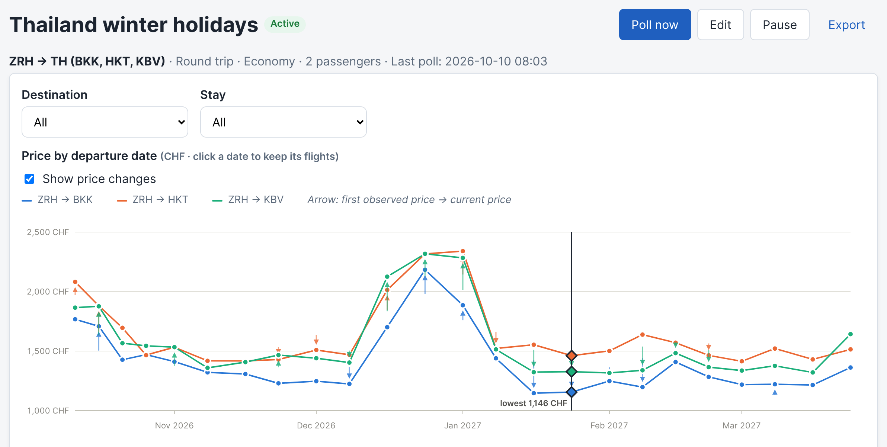
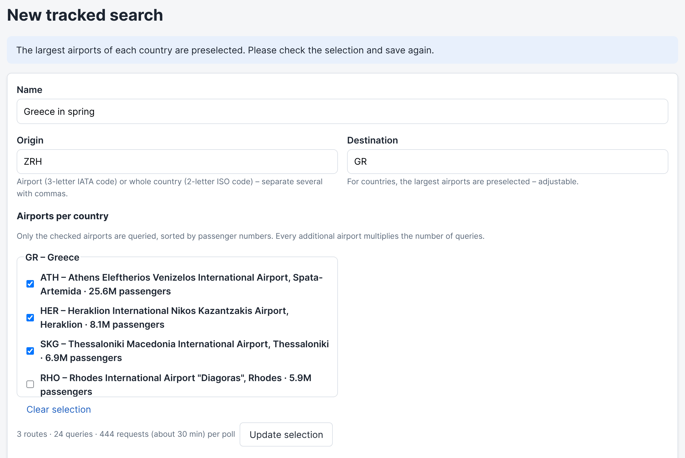
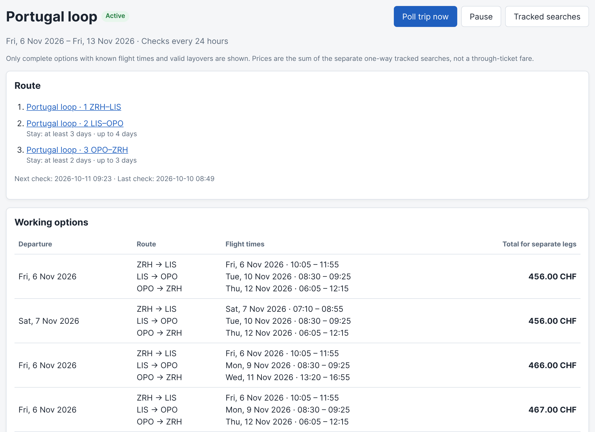
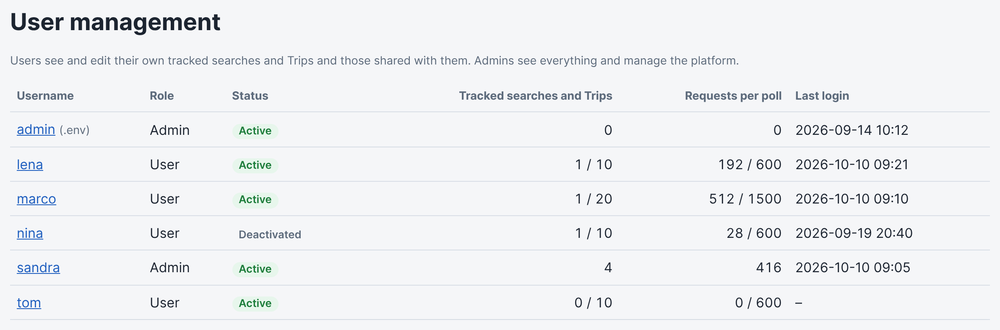
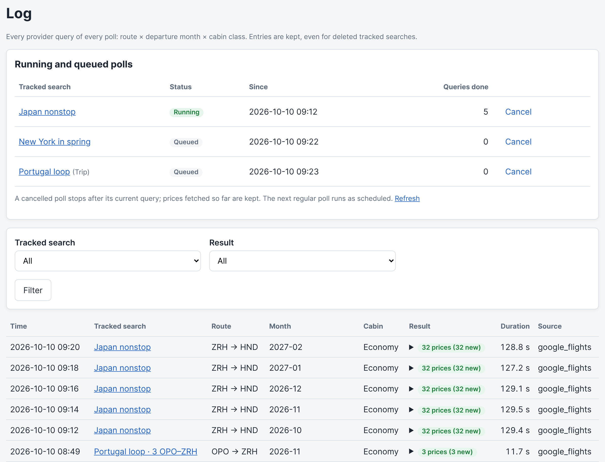
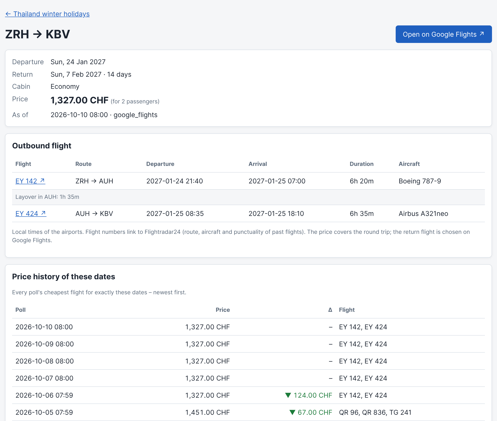
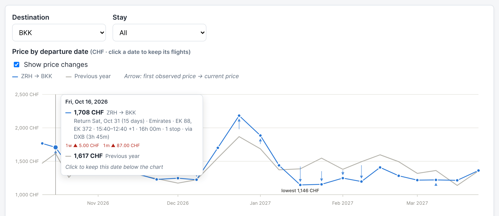

# Plane and simple ✈

Self-hosted flight price tracker: Suchabos (tracked searches) in a web UI in English or German, a background
worker that collects prices, and an append-only price history with a previous-year comparison.



<sub>Screenshots: the real web UI with invented demo data.</sub>

Design and conventions: [architecture.md](architecture.md) · data model: [datamodel.md](datamodel.md)
· backlog: [userstories.md](userstories.md).

## Quick start (devcontainer)

1. Open the folder in VS Code → "Reopen in Container". After any change to `.devcontainer/`, run
   **"Dev Containers: Rebuild Container"** (a plain reopen keeps the old containers). Claude Code
   is installed automatically and the login persists across rebuilds (volume `claude-config`).
2. Everything else happens automatically:
   - `.env` is generated with random secrets (`python -m flighttracker.cli init-dev-env`); the
     dev login is printed and noted at the top of `.env`.
   - `migrate` creates the schema and imports the airports.
   - `web` and `worker` run in their own containers and restart on every change of the code or
     `.env` – no rebuild, no manual restart.
3. Open http://localhost:8000. VS Code forwards the port from the `web` container (tab "Ports";
   if 8000 is taken locally, VS Code picks another port and shows it there).

Logs and restarts from the devcontainer terminal:
`docker compose -p planeandsimple_devcontainer logs -f web worker migrate` (project name: see
`docker compose ls`).

Optional: enter a Wikidata contact (your URL or e-mail) under **Settings → Platform Settings**
and start the airport import there, so that countries preselect their largest airports by
passenger numbers. (`WIKIDATA_CONTACT` in `.env` works too, but the CLI only sees it after a
container rebuild.)



Tests: `pytest` (integration tests use `TEST_DATABASE_URL`, preset in the devcontainer).
Lint: `ruff check . && ruff format --check .`

## Trip Planner

Open **Trip Planner** to build a route from 2–8 airport-to-airport legs. Each becomes its own
one-way tracked search and appears under the Trip in **Tracked searches**. Set the first-departure
to final-arrival date window (up to 60 days) and min/max layover before each following leg; Trips
are checked at the global poll interval. The worker polls the first leg within the window, then queries only candidate dates
that could connect to a known previous arrival; Trip legs are not polled by the normal monthly
scheduler.



The planner currently requires Google Flights (or the development-only mock provider), because a
provider must return departure and arrival times to verify connections. Complete options show the
sum of the separate one-way prices, not a through-ticket fare; self-transfers and separately
booked connections are not protected. Options list the 200 cheapest current combinations (flights from the
latest poll, no past departures). A Trip can be paused, archived and deleted together with its legs.

## Users

The admin from `.env` (`ADMIN_USERNAME` / `ADMIN_PASSWORD_HASH`) always works and cannot be
locked out from the UI. Admins create further users under **Users** (top bar):

- **Users** see and fully edit their own tracked searches and Trips and can share each one with
  other users, view-only or view-and-edit. Editors can change, pause and poll, but not archive,
  delete or share. Admins see and manage everything; tracked searches from before user
  management belong to the admin from `.env` (assigned on its next login).
- **Deactivating or deleting** a user pauses their tracked searches and Trips – except those
  another active user may edit, which keep running until no such editor is left. A deleted
  user's tracked searches and Trips go to the admin from `.env`.
- **Limits** per user (admins have none), so that API usage cannot run away: at most
  `MAX_SEARCHES_PER_USER` (10) tracked searches and Trips, and at most `MAX_REQUESTS_PER_USER`
  (600) provider requests per poll for all of them together – the request budget is what really
  costs, since one broad search can need more requests than twenty narrow ones. Both are
  defaults under **Settings → Platform Settings** and can be changed per user.
- **Settings** shows every user their personal settings (language, time zone, password);
  Platform Settings, export and import are only shown to admins.



The **Poll Log** lists running and queued polls; whoever may edit a tracked search can cancel
its poll there (a running poll stops after its current query, prices fetched so far are kept).



## Production (Docker Compose, reverse proxy with TLS)

One-time setup on the server:

```bash
git clone https://github.com/<owner>/planeandsimple.git
cd planeandsimple
cp .env.example .env    # fill in POSTGRES_PASSWORD, SECRET_KEY and ADMIN_PASSWORD_HASH (see below)
bash scripts/deploy.sh
```

Generate the secrets with `openssl rand -hex 24` for `POSTGRES_PASSWORD` and
`openssl rand -hex 32` for `SECRET_KEY`. The admin password hash (`ADMIN_PASSWORD_HASH`) needs
the app, but no Python on the server:

```bash
docker build -t flighttracker:latest -f docker/Dockerfile --target prod .
docker run --rm -it flighttracker:latest python -m flighttracker.cli hash-password
```

If you deploy from a private fork instead, clone over SSH with a read-only GitHub "Deploy key"
(`ssh-keygen -t ed25519 -f ~/.ssh/planeandsimple -N ""`, add the `.pub` in the repo settings).

Every update: `bash scripts/deploy.sh` (= `git pull` + `docker compose up -d --build`). Migrations and
the first airport import run automatically in the `migrate` service.

The web container listens on `127.0.0.1:${WEB_PORT}`. Put a reverse proxy with TLS in front
and keep `SESSION_COOKIE_SECURE=true`. Set `FORWARDED_ALLOW_IPS` to the address the proxy
connects from, otherwise the login lockout counts every visitor as one client: a proxy on the
Docker host arrives from the Compose network's gateway (see the command in `.env.example`), a
proxy container on the same network from its own container IP.

## Home server on the local network (no reverse proxy, no CI/CD)

If the server is only reachable from your own LAN and you access it directly by IP and port
(e.g. `http://192.168.1.50:8000`), you don't need a reverse proxy or TLS. Every update is
triggered manually and built on the server itself – there is no CI/CD pipeline.

Two ways to get the code onto the server; pick whichever you prefer, both use the same
`docker-compose.yml` and `scripts/deploy.sh` once the code is there.

### Option A: `git clone` on the server

Same one-time setup as above. This is the more convenient option if you want a clean history of
what's deployed – you can check which commit is live (`git log -1`) and roll back with
`git checkout <sha> && bash scripts/deploy.sh`.

### Option B: copy the working tree to the server (no Git on the server)

If you'd rather keep Git off the server entirely, copy the files directly
and build there:

```bash
# From your workstation, excluding local/dev-only files:
rsync -az --delete \
  --exclude .git --exclude .venv --exclude __pycache__ --exclude .env \
  ./ youruser@server:/opt/planeandsimple/

ssh youruser@server
cd /opt/planeandsimple
cp .env.example .env   # first time only; keep the server's .env, rsync excludes it afterwards
docker compose up -d --build --remove-orphans
```

`scripts/deploy.sh` stops at its `git pull` step when there is no `.git` directory, so use the
`docker compose` command directly. Every update is then: re-run the `rsync` command, then
`docker compose up -d --build --remove-orphans` on the server.

### LAN-only `.env` settings

```ini
# Reachable from the whole LAN, not just localhost. Use the server's LAN IP to restrict
# it to one interface, or 0.0.0.0 for every interface.
WEB_BIND=0.0.0.0
WEB_PORT=8000
# No TLS on a local network: the cookie is only sent in plaintext on your own LAN.
SESSION_COOKIE_SECURE=false
```

`WEB_BIND`/`WEB_PORT` control the **published** port in `docker-compose.yml` (`services.web.ports`);
change them in `.env` any time, no file edits needed, and re-run `bash scripts/deploy.sh` (or
`docker compose up -d`) to apply. The `db` service has no published port and is only reachable
inside the Compose network, by design.

## Flight data

- `google_flights` (default in `.env.example` and Compose; without any `FLIGHT_PROVIDER` the app
  falls back to `mock`): real live fares from Google Flights, **no account or token**.
  Best effort – it scrapes the page and may break when Google changes it.
  Each poll also reads Google's price calendar (cheapest price of every departure day, 61 days
  per request) for the heat map on the tracked search page.
- `travelpayouts`: cached Aviasales prices, needs a free token from travelpayouts.com →
  `TRAVELPAYOUTS_TOKEN`.
- `mock`: fake prices for tests.



There is no historical backfill: no free source offers past fares. The previous-year comparison
fills up through the app's own tracking.



The active provider, worker and airport-import settings above can also be changed at runtime
from **Settings → Platform Settings** in the web UI (overrides `.env`, no restart needed); that
page is also where the admin exports/imports all data as JSON and can trigger a fresh airport
import.

## Dependencies

| Package | Why |
|---|---|
| fastapi, uvicorn | Web framework and ASGI server (project standard) |
| jinja2 | Server-rendered templates (project standard) |
| python-multipart | HTML form parsing for FastAPI |
| itsdangerous | Signed session cookie (Starlette `SessionMiddleware`) |
| sqlalchemy, alembic, psycopg | ORM, migrations, PostgreSQL driver (project standard) |
| pydantic, pydantic-settings | Filter validation, configuration from env |
| httpx | HTTP client for provider APIs and the airport import |
| fast-flights *(extra `scraper`)* | Google Flights scraper; pinned because its API changes between versions. Its HTTP client `primp` is used directly to send the consent cookie |
| pytest, ruff *(extra `dev`)* | Tests and lint/format |

Airport data: [OurAirports](https://ourairports.com/data/) (public domain), downloaded at runtime and not stored in the repo.

## License

[MIT](LICENSE).
